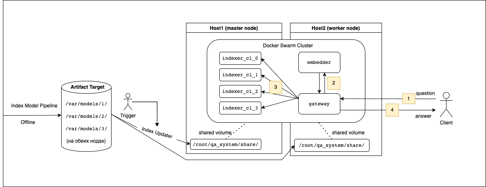

# QA-system

Question answering system with micro-service architecture. 

Certain logic is encapsulated into separate micro-service. 
All the services has own API and could communicate with each other.
This architecture allows to scale system and give fault tolerance.

Building, delivery and launching happens automatically when ci/cd pipeline is triggered.

