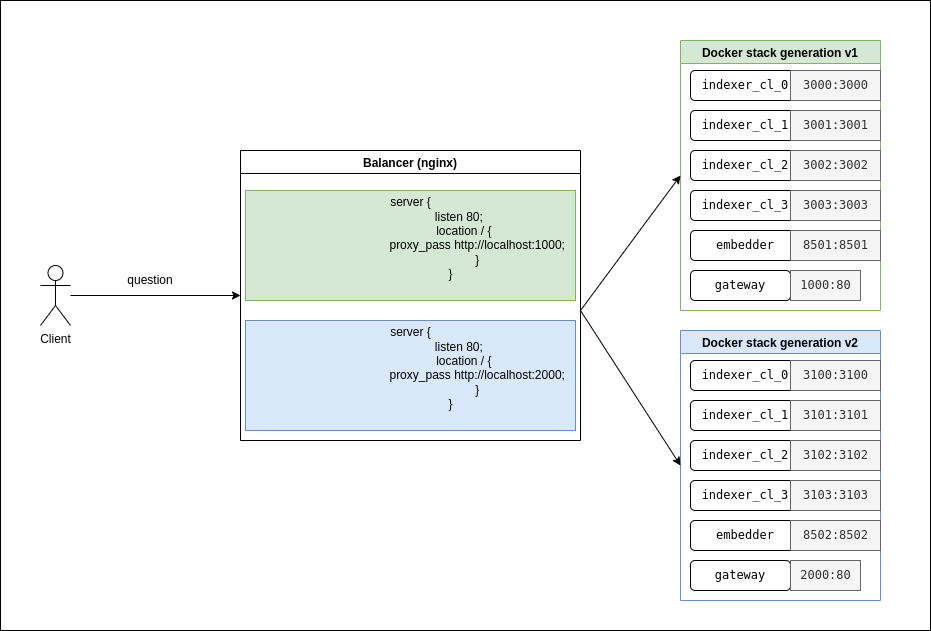

# Green-Blue Index Updater

For zero-downtime update, new index should be deployed with another  ```docker stack``` at different ports with external balancing tool (e.g., ```nginx```), that switches traffic to the new  ```gateway```.

1. Updated ```docker-compose.yml``` with added paths to new index generation, ports, etc., should be added to  ```index_updater```. 

2. Deploy with the same command:
  ```bash
  docker stack deploy --compose-file qa_system/docker-compose.yml qa_system_2
  ```
but with different compose file and service name 

3. When new ```stack``` is deployed, one should trigger external balancing tool, in order to switch traffic to new service. For example, ```nginx``` in reverse-proxy mode and updated config file could be restarted with next command:
 ```bash
 systemctl restart nginx
 ```

4. Kill the old version service:
```bash
docker rm qa_system_1
```
